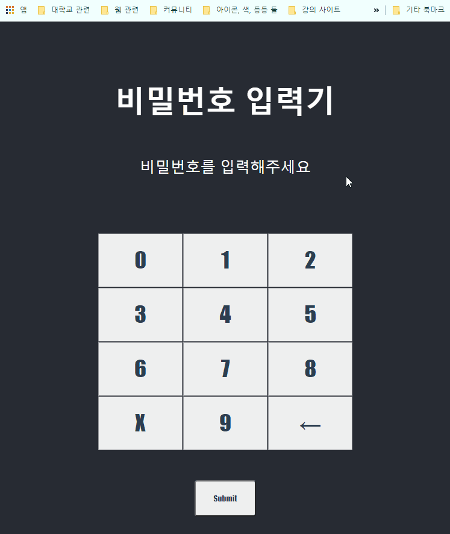

# password_inputter

 

  해킹방지용 비밀번호 입력기입니다!    
  (Password Entry to Prevent Hacking !)

 

  

  <a href="#usage">Usage</a> •
  <a href="#key-features">Key-Features</a> •
  <a href="#author">Author</a> •
  <a href="#license">License</a>

 

  
## Usage

<code>$ git clone https://github.com/SeoSang/password_inputter.git</code>

Inputter.tsx 로 돼있는 컴포넌트를  
Inputter.css 의 스타일시트와 함께 사용하시면 됩니다!

## Key-Features

- 랜덤하게 바뀌는 입력기 ( Random Number Inputter ) 
- 입력 문자 설정 가능 ( Can set input characters )
> shuffleNums function 안에 nums_random 수정으로 입력 기호 변경 가능
- 길이 설정 가능 ( Configuring Password Length )
  

## Author

- [SeoSang](https://github.com/SeoSang)
- Blog : programming119.tistory.com
- E-mail : (ddrrpg@naver.com)

## License

MIT